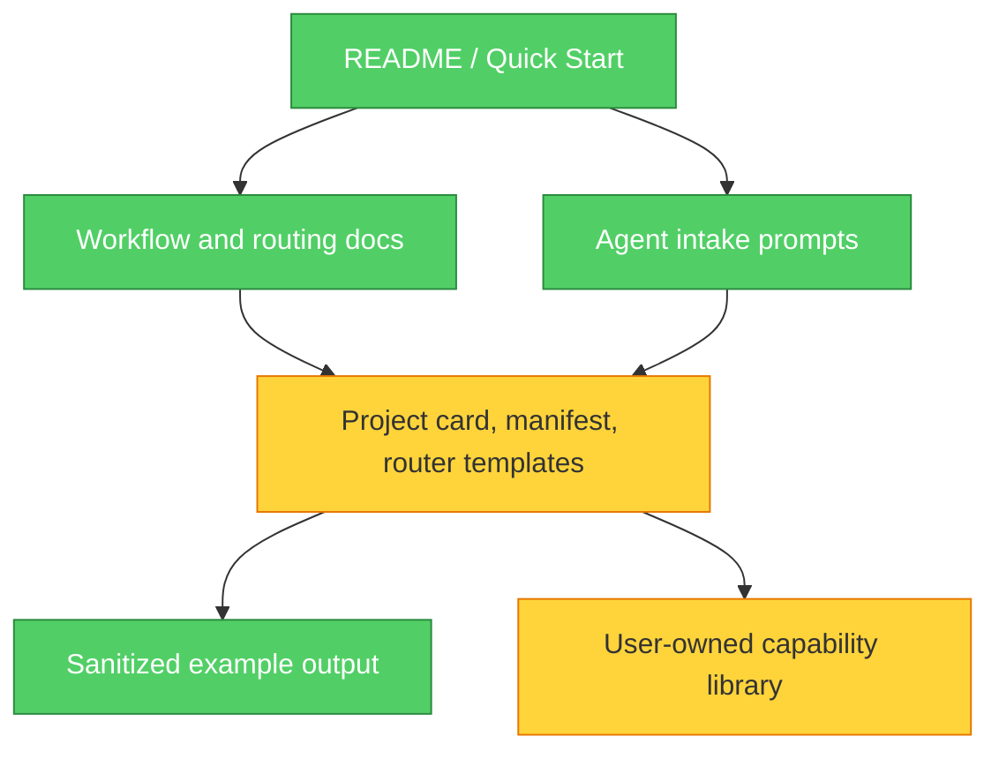

# Table-GitHub-Capability-Router Evaluation

- GitHub: https://github.com/duoduoler-ops/Table-GitHub-Capability-Router
- Evaluated: **2026-07-21**
- Commit: `1d88c2faa488db90ee7fab7aeed2f1005a21e056`
- Mode: online check + full static review
- License: MIT
- Project type: Markdown-first governance workflow and templates
- Capability slot: evaluate agent capabilities and produce intake, lifecycle, and routing records
- Retention grade: **B / reference**

## 30-Second Positioning

- Replaces: flat, manually curated lists of tools with no activation boundary or lifecycle state.
- Enhances: this repository's pinned inventory, installer, reconciliation, and integrity verification.
- Produces: project cards, capability manifests, a thin L1/L2 router, and maintenance records.
- Does not produce: an executable package manager, Codex visibility controls, automatic health checks, or enforced routing.
- Decision: **combine the governance model with the existing machine-readable repository; do not install or mirror the project as a Skill.**

## Architecture

The architecture is intentionally documentation-only. Its strongest boundary is conceptual: evidence is kept in project cards, reusable knowledge in distillation pages, routing in a thin registry, and full capability bodies outside the hot context. Its weakest boundary is mechanical: the templates and generated records have no schema or validator, so consistency depends on the agent following prose correctly.

## Findings

### Warning: Markdown is the only source of enforcement

Symptom: Stable IDs, candidate limits, lifecycle states, manager-type restrictions, and idempotency are described in prose but are not machine-checked.

Source: *The Pragmatic Programmer* - DRY; *A Philosophy of Software Design* - Information Leakage.

Consequence: A large capability library can accumulate stale routes, unknown targets, duplicate cards, or a manager-type tool marked for automatic use without any failing check.

Remedy: Keep the project's governance vocabulary, but encode the active thin registry in JSON and validate it against the pinned skills and plugin inventories.

### Warning: The router is advisory, not a Codex visibility control

Symptom: The repository explicitly states that L1 does not hide or disable native Skills, Plugins, MCP tools, or hooks.

Source: *Clean Architecture* - Policy versus mechanism boundary.

Consequence: Treating the Markdown router as an enforcement layer would create false confidence; broad native descriptions can still participate in discovery.

Remedy: Label generated routing artifacts as a soft decision layer and keep installation, invocation, hooks, and client configuration under separate approval gates.

### Suggestion: Client-context claims require local verification

Symptom: The project explains discovery cost, truncation, and always-visible budgets, while also noting that exact loading behavior varies by client and version.

Source: *Software Engineering at Google* - evidence before relying on observable behavior.

Consequence: Fixed token or visibility assumptions can become stale as Codex changes plugin and tool loading behavior.

Remedy: Preserve the qualitative routing model, but do not encode unverified token thresholds or claim that all plugin schemas are always resident.

## Adopted Into This Repository

1. Full inventory and thin routable registry are separate artifacts.
2. Every L1 category contains at most three candidates, with `baseline-direct` as the default fallback.
3. Deployment, management, health, invocation, authorization, and risk are separate fields.
4. Trigger and do-not-use boundaries are both required for every routable entry.
5. Manager-type capabilities must be `explicit-only`.
6. Plugin entries remain `unverified` until a live invocation check succeeds.
7. JSON is the source of truth; Markdown is generated and checked for drift.

## Not Adopted

- Obsidian-specific vault paths and inbox structure.
- A capability card for every cached or nested skill.
- Installing this repository as a Skill or adding it to the always-visible layer.
- Automatic changes to Codex configuration, hooks, plugin visibility, or invocation policy.
- Score-driven automatic promotion to active routing.

## Verification Plan

- `python scripts/capability_router.py --check`
- `python scripts/verify.py`
- `python -m unittest discover -s tests -v`
- CI rejects unknown targets, stale generated Markdown, duplicate IDs, oversized L1 categories, and non-explicit manager-type entries.

## Review Triggers

Review this decision when the upstream project adds an executable schema/validator, when Codex exposes supported native visibility controls, or when this repository's routing categories no longer match the user's recurring work.
